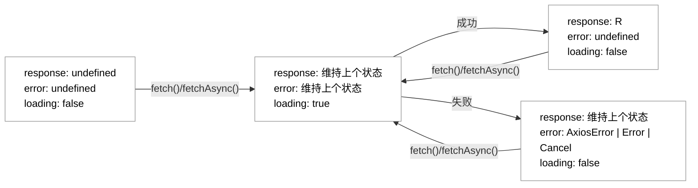

# useAxios

[](https://www.npmjs.com/package/@qiweipeng/use-axios)
[](https://www.npmjs.com/package/@qiweipeng/use-axios)
[](LICENSE)

基于 `Axios` 的 `React Hooks` 封装，同时集成 [Zod](https://zod.dev) 实现对运行时对象的数据校验。

- [功能点](#功能点)
- [快速开始](#快速开始)
  - [安装](#安装)
  - [使用](#使用)
    - [请求详情页示例](#请求详情页示例)
    - [点击按钮跳转页面请求示例](#点击按钮跳转页面请求示例)
- [状态流转图](#状态流转图)
- [API](#api)
  - [useAxios()](#useaxios-1)
    - [参数](#参数)
      - [config](#config)
      - [options(可选)](#options可选)
    - [返回值](#返回值)
      - [response](#response)
      - [error](#error)
      - [loading](#loading)
      - [fetchAsync](#fetchasync)
      - [fetch](#fetch)
      - [cancel](#cancel)
      - [requestInterceptors](#requestinterceptors)
      - [responseInterceptors](#responseinterceptors)
  - [useValidatedAxios()](#usevalidatedaxios)
    - [validationSchema（可选）参数](#validationschema可选参数)
    - [options新增字段(可选)](#options新增字段可选)
    - [ValidationError](#validationerror)
- [协议](#协议)

## 功能点

- [x] 完全基于 `Axios`，使用 `Axios` 实例创建，各个请求互不影响
- [x] 完全基于 `TypeScript`，提供完善的类型定义
- [x] Zod 支持，保证运行时数据类型安全
- [x] 网络请求可取消
  - [x] 组件释放自动取消
  - [x] 竞态取消
- [x] 手动请求（默认）或自动请求
- [x] loading delay
- [x] mock
- [ ] 防抖
- [ ] 轮询
- [ ] 错误重试
- [ ] 依赖刷新

## 快速开始

### 安装

``` bash
yarn add @qiweipeng/use-axios
# 或者
npm install --save @qiweipeng/use-axios
```

### 使用

#### 请求详情页示例

``` typescript
import {useAxios} from '@qiweipeng/use-axios';

export function Foo() {
  const {response, error, loading, fetch} = useAxios(
    {
      url: 'https://...',
      method: 'post', // post 请求默认 json 类型，如果希望表单类型则在 headers 中添加 `'Content-Type': 'application/x-www-form-urlencoded'`
      data: {
        id: 0,
      }, // 参数，如果是 get 请求则在 params 中配置
      headers: {
        ''
      },
    },
    {automatic: true}, // 页面加载后自动请求一次
  );

  // 页面加载中，展示加载指示器
  if (loading) {
    return <Text>加载中……</Text>;
  }

  // 页面加载失败，展示错误提示和重试按钮
  if (!response) {
    return (
      <View>
        <Text>页面加载失败</Text>
        <Button
          title="重试"
          onPress={() => {
            fetch();
          }}
        />
      </View>
    );
  }

  // 页面加载成功，展示页面内容
  return <Text>{JSON.stringify(response.data)}</Text>;
}

```

#### 点击按钮跳转页面请求示例

``` typescript
import {useAxios} from '@qiweipeng/use-axios';

export function Bar() {
  const {loading, fetchAsync} = useAxios({
    url: 'https://...',
    method: 'post',
    data: {
      username: '',
      password: '',
    }, // 参数可以在初始位置填入，也可以在 fetchAsync 调用时传入，如果调用时再传入，这里仅仅描述类型即可
  });

  function handleLoginButtonClick() {
    fetchAsync({
      data: {
        username: 'roger',
        password: '123456',
      }, // 这里会进行类型检查，一定是满足接口定义时的条件，否则报错
    })
      .then(() => {
        // 登录成功，保存 token
      })
      .catch(() => {
        // 登录失败，吐司提示
      });
  }

  return (
    <View>
      <Text>内容</Text>
      <Button title="登录" onPress={handleLoginButtonClick} />
      {/* 页面加载中，展示加载指示器 */}
      {loading && <Spinner />}
    </View>
  );
}

```

## 状态流转图

默认情况下网络请求的状态流转过程如下：



会影响状态流转的 `options`：

1. `loadingDelay`：`loadingDelay` 大于 `0` 时会影响 `loading` 状态延迟更新。

## API

### useAxios()

#### 参数

##### config

`config` 参数为 `Axios` 中的 `AxiosRequestConfig` 类型，具体参见 [Request Config](https://github.com/axios/axios#request-config)。

常见的字段如下：

| 字段    | 描述        |
|---------|-------------|
| `url`     | url         |
| `method`  | 请求方法    |
| `baseURL` | base url    |
| `headers` | 请求头      |
| `params`  | get请求参数 |
| `data`    | 请求体参数  |
| `timeout` | 超时时间    |

> 关于 `config` 的覆盖规则⚠️：
>
> 1. `fetchAsync` 方法调用时传入的 `config` 会**增量**覆盖接口定义时传入的 `config`，即在保留所有原有字段配置的情况下有该字段则**修改**，没有该字段则**添加**。
> 2. `config` 中的 `params` 和 `data`，在方法调用时同样会**增量**覆盖。

##### options(可选)

该字段用于配制接口的功能和行为，完整的描述如下：

| option | 描述 | 类型 | 默认值 |
|--------|-----|:----:|:-----:|
| `automatic`       | 是否是自动请求（如果是自动请求则会在组件加载后进行一次请求）                | `boolean`      | `false`   |
| `loadingDelay` | loading 状态是否延迟更改，单位为毫秒（请求开始后在 loadingDelay 范围内 loading 状态保持为 false 不变） | `number` | `0`      |

#### 返回值

##### response

类型：`R = AxiosResponse<T, D> | undefied`

`response` 为 `undefied` 的情况参见`状态流转图`，其不为 `undefied` 时是一个 `Axios` 中的 `AxiosResponse` 类型，具体参见 [Response Schema](https://github.com/axios/axios#response-schema)。

##### error

类型：`AxiosError<unknown, D> | Error | Cancel | undefied`

`error` 为 `undefied` 的情况参见`状态流转图`，其不为 `undefied` 时分三种情况：

1. `Cancel`：网络请求取消，其中 `Cancel` 类型是 `Axios` 中内置的类型。
2. `AxiosError`：网络请求出错，具体参见 [Handling Errors](https://github.com/axios/axios#handling-errors)。
3. `Error`：接口配置有误，发生在网络请求开始之前（通常接口参数等填写正确，网络请求能发起，就不会有该错误），具体参见 [Handling Errors](https://github.com/axios/axios#handling-errors)。

##### loading

类型：`boolean`

`loading` 的状态变化参见`状态流转图`。需要注意的是，如果 `options` 中设置了 `loadingDelay` 的值，则其状态变化会发生调整。

##### fetchAsync

类型：`(config?: AxiosRequestConfig<D>) => Promise<R>`

发起请求方法，具体用法可参见 `点击按钮跳转页面请求示例`。

> 💡提示：
>
> 接口参数变化不会触发接口调用，唯一会触发接口调用的方式是调用 `fetchAsync` 或 `fetch` 方法。
> `fetchAsync` 或 `fetch` 在接口所在组件整个生命周期中不会发生变化，可以放心加入 `useEffect` 依赖数组中。

##### fetch

类型：`(config?: AxiosRequestConfig<D>) => void`

`fetch` 方法是 `fetchAsync` 的非异步版本，其内部就是：

``` typescript
fetchDataAsync(c).catch(() => {
  return;
});
```

当使用 `fetch` 方法时，请求结果就要依赖 `response` 和 `error` 两个返回值。

⚠️需要注意的是，网络请求结束到 `response` 或 `error` 状态的更新是需要经历一次 `React` 组件的状态更新周期的，也就是说，`response` 或 `error` 的状态更新会比 `fetchAsync` 方法回调晚一些。

##### cancel

类型：`() => void`

手动取消正在进行的网络请求。

> 💡提示：
>
> 1. 接口所在组件释放时，正在进行的请求会立即取消。
> 2. 同一个接口下一次请求开始时（如多次调用 `fetch` 方法），上一次未完成的请求会立即取消。
> 3. 网络请求取消会被错误捕捉到，因此在进行 `fetchAsync` 方法的错误处理时，需要考虑 `Cancel` 类型的处理。

##### requestInterceptors

类型：`AxiosInterceptorManager<AxiosRequestConfig<D>>`

请求拦截器，具体参见 [Interceptors](https://github.com/axios/axios#interceptors)。其在项目的用法示例如下：

``` typescript
import {useAxios} from '@qiweipeng/use-axios';

export function Baz() {
  const {response, error, loading, fetch, requestInterceptors} = useAxios({
    url: 'https://...',
    method: 'get',
  });

  useEffect(() => {
    const requestInterceptor = requestInterceptors.use(
      c => {
        // 做一些事情
        return c;
      },
      e => {
        // 做一些事情
        return Promise.reject(e);
      },
    );
    return () => {
      requestInterceptors.eject(requestInterceptor);
    };
  }, [requestInterceptors]);

  return <Text>内容</Text>;
}
```

##### responseInterceptors

类型：`AxiosInterceptorManager<AxiosResponse<T, D>>`

响应拦截器，具体参见 [Interceptors](https://github.com/axios/axios#interceptors)。其在项目的用法示例如下：

``` typescript
import {useAxios} from '@qiweipeng/use-axios';

export function Qux() {
  const {response, error, loading, fetch, responseInterceptors} = useAxios({
    url: 'https://...',
    method: 'get',
  });

  useEffect(() => {
    const responseInterceptor = responseInterceptors.use(
      r => {
        // 做一些事情
        return r;
      },
      e => {
        // 做一些事情
        return Promise.reject(e);
      },
    );
    return () => {
      responseInterceptors.eject(responseInterceptor);
    };
  }, [responseInterceptors]);

  return <Text>内容</Text>;
}
```

### useValidatedAxios()

`useValidatedAxios()` 是在 `useAxios()` 的基础上增加 `Zod` 库的支持，参数增加 `validationSchema`，`options` 参数中增加 `mock` 字段，返回值中 `error` 的类型增加 `ValidationError` 类型，除此之外完全相同。使用 `useValidatedAxios()` 时如果不传 `validationSchema` 参数则和 `useAxios` 用法完全一致。

#### validationSchema（可选）参数

这是一个 `Zod` 中的 `ZodTypeAny` 类型，具体参见 [Zod](https://zod.dev)。

使用中，该参数用于描述 `response` 中的数据格式，具体可以：

1. 校验每个字段的类型、是否为空等。
2. 设置约束字段的具体条件，如 `string` 类型的长度或是否为 `URL`、`number` 类型是否在某个范围之内等。
3. 对数据进行转换，如将 `gender` 字段返回的 `0` 或 `1` 修改为一个枚举。

应用示例如下：

``` typescript
import {useAxios} from '@qiweipeng/use-axios';
import {z} from 'zod';

export function Fred() {
  const {fetchAsync} = useValidatedAxios(
    {
      url: 'https://...',
      method: 'get',
    },
    undefined,
    z.object({
      name: z.string(),
      phoneNumber: z.number().nullish(),
    }),
  );

  return (
    <Button
      title="获取个人信息"
      onPress={() => {
        fetchAsync()
          .then(response => {
            // ⭐️如果请求成功，那么 response 是类型安全的
            response.data.name; // string
            response.data.phoneNumber; // number | null | undefined
          })
          .catch(() => {
            // 请求失败，包含数据校验失败的情况
          });
      }}
    />
  );
}
```

#### options新增字段(可选)

| option | 描述 | 类型 | 默认值 |
|--------|-----|:----:|:-----:|
| `mock`       | 是否使用 mock 数据（如果是则请求一定成功且按照 `validationSchema` 的描述提供 mock 数据），只在 `validationSchema` 不为空时才有效；需要注意的是，`mock` 开启后，请求响应中除了 `status` 和 `data` 外的字段均有可能为空⚠️                | `boolean`      | `false`   |

参见 [zod-mock](https://github.com/anatine/zod-plugins/tree/main/packages/zod-mock)。

#### ValidationError

`ValidationError` 是 `useValidatedAxios()` 相比于 `useAxios()` 新增的一种错误类型，表示数据校验失败的错误。它继承自 `Zod` 的 `ZodError`，在其基础上增加了 `response` 属性，可以在错误处理时完整获取到接口返回到 `response`。其具体实现如下：

``` typescript
class ValidationError<T, D> extends z.ZodError {
  response: AxiosResponse<T, D>;
  constructor(issues: z.ZodIssue[], response: AxiosResponse<T, D>) {
    super(issues);
    this.name = 'ValidationError';
    this.response = response;
  }
}
```

关于 `ZodError` 具体参见 [Error handling](https://zod.dev/?id=error-handling)。

## 协议

MIT
